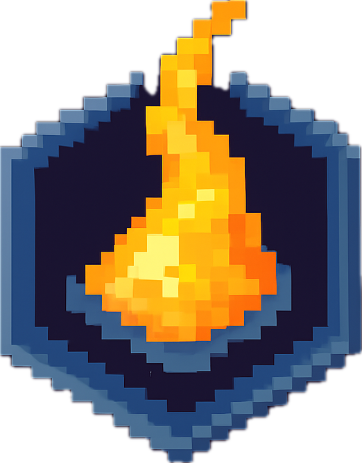

# 🧪 ReAgenyx

**Walk-to-Earn Web3 Mobile Game | Chemistry + NFTs + Real Movement**

> Turn your daily steps into blockchain-verified elements. Discover, craft, and trade while exploring the real world.

[](godot-mobile/) [](godot-mobile/) [](solana-contracts/)



---

## 🌟 What is ReAgenyx?

ReAgenyx is a **move-to-earn mobile game** where your real-world movement rewards you with in-game materials that become NFTs on the blockchain. Walk, collect elements, perform chemistry reactions, and trade discoveries in a player-driven economy.

### Key Features:
- 🚶‍♂️ **Movement Rewards** - Walk to collect raw materials (50m = 1 chunk)
- 🧪 **Chemistry System** - React elements to create compounds (10 elements, 4 reaction types)
- 💎 **NFT Discovery** - First discoverers get blockchain-verified credit + no taxes
- 🏪 **Decentralized Marketplace** - Trade elements with alSOL (Solana-backed currency)
- 📱 **Health Integration** - iOS HealthKit & Android Health Connect (anti-cheat)
- ⚡ **Alchemy Gloves** - Level up to unlock better success rates

---

## 📱 Quick Start

### For Players:

1. **Download** (coming soon to App Store / Play Store)
2. **Connect Wallet** (Solana Mobile Wallet Adapter)
3. **Start Walking** - Get raw lkC (carbon) every 50 meters
4. **Analyze Materials** - Use Alchemy Gloves to clean raw elements
5. **Perform Reactions** - Create compounds and rare materials
6. **Trade & Earn** - Discover new elements, trade on marketplace

### For Developers:

```bash
# Clone repository
git clone https://github.com/yourusername/ReAgenyx.git
cd ReAgenyx

# Backend API (Node.js + PostgreSQL)
cd backend
npm install
npm run dev

# Solana Contracts (Anchor)
cd solana-contracts
anchor build
anchor test

# Mobile App (Godot 4)
# Open godot-mobile/ in Godot Engine 4.x
```

---

## 🏗️ Architecture

### System Components:

```
┌─────────────────────────────────────────────────────────────┐
│                    Mobile App (Godot 4)                      │
│  • iOS 15+ / Android 14+                                    │
│  • HealthKit / Health Connect integration                   │
│  • In-game chemistry system                                 │
└───────────────────┬─────────────────────────────────────────┘
                    │ REST API
                    ▼
┌─────────────────────────────────────────────────────────────┐
│               Backend API (Node.js + Express)                │
│  • PostgreSQL database (in-game DATA)                       │
│  • alSOL swap logic (SOL/LKC → alSOL)                      │
│  • Element bridge validation                                │
└───────────────────┬─────────────────────────────────────────┘
                    │ RPC Calls
                    ▼
┌─────────────────────────────────────────────────────────────┐
│           Solana Programs (Anchor Framework)                 │
│  • Element NFT Program                                      │
│  • Marketplace Program (alSOL trading)                      │
│  • Registry Program (discovery tracking)                    │
│  • Burn Proof Program (DATA → NFT bridge)                  │
└─────────────────────────────────────────────────────────────┘
```

### Data Flow Philosophy:

**In-Game = Database (Fast, Free)**
- Element collection, reactions, inventory
- No gas fees for gameplay
- Instant feedback

**Blockchain = Ownership (Verified, Permanent)**
- NFT minting (when bridging)
- Marketplace trades
- Discovery records
- Only when users explicitly bridge

---

## 🎮 Game Mechanics

### Movement → Materials

| Distance | Chunks | Raw lkC (walking) | Time |
|----------|--------|-------------------|------|
| 500m | 10 | ~150 | 6 min |
| 1 km | 20 | ~300 | 12 min |
| 5 km | 100 | ~1,500 | 1 hour |

**Anti-Cheat:**
- Walking (0.7-0.8m/step): 95% efficiency ✅
- Jogging (1.0-1.2m/step): 85% efficiency
- Running (1.2-1.5m/step): 70% efficiency
- Vehicle (>2m/step): 0% efficiency ❌

### Chemistry System

**Elements (10 total):**
- Common (5): lkC, lkO, lkH, lkN, lkSi
- Uncommon (2): CO2, H2O
- Rare (2): Coal, lkC14
- Legendary (1): Carbon_X

**Reactions (4 types):**
```
Physical (1⚡):    lkC × 5 → Coal × 1
Chemical (2⚡):    lkC + lkO × 2 → CO2 × 1
                  lkH × 2 + lkO → H2O × 1
Nuclear (5⚡):     lkC + [lkC14] → lkO × 2 (10% success)
```

See [ELEMENTS_AND_REACTIONS.md](docs/ELEMENTS_AND_REACTIONS.md) for full details.

### Discovery System

**First Discovery Bonus:**
- Blockchain-verified credit (NFT)
- No taxes for 72 hours
- Others pay 10% tax → you get 2× during lock period

**Tax After Discovery:**
- 10% of created elements → treasury
- Funds original discoverers
- Encourages early exploration

---

## 🔗 Blockchain Integration

### Solana Programs

| Program | Address | Purpose |
|---------|---------|---------|
| **Element NFT** | `ELeMNFT...` | Mint elements as SPL tokens |
| **Marketplace** | `MKTPLCE...` | Trade NFTs with alSOL |
| **Registry** | `REGSTRy...` | Track first discoveries |
| **Burn Proof** | `BRNPRooF...` | Verify DATA → NFT bridge |

### alSOL Token

**In-game currency backed 1:1 by SOL:**
- Swap SOL → alSOL (instant)
- Swap LKC → alSOL (1M lkC = 1 alSOL, 1/week limit)
- Use for marketplace trades
- Withdraw to SOL anytime

**Purpose:** Stable in-game currency without SOL price volatility

---

## 📂 Project Structure

```
ReAgenyx/
├── landing-page/            # Marketing website + waitlist
│   ├── index.html          # Landing page
│   ├── css/style.css       # Responsive styles
│   └── js/script.js        # Waitlist form
│
├── backend/                 # Node.js API + PostgreSQL
│   ├── src/
│   │   ├── routes/         # API endpoints (+ waitlist)
│   │   ├── db/             # Database schema
│   │   └── services/       # Business logic
│   └── package.json
│
├── solana-contracts/        # Anchor programs
│   ├── programs/
│   │   ├── element-nft/    # NFT minting
│   │   ├── marketplace/    # Trading platform
│   │   ├── registry/       # Discovery tracking
│   │   └── burn-proof/     # Bridge validation
│   └── Anchor.toml
│
├── godot-mobile/            # Godot 4 mobile app
│   ├── autoload/           # Global managers
│   ├── scenes/             # Game scenes
│   ├── scripts/            # Game logic
│   ├── assets/             # Icons, configs
│   └── plugins/            # Health API plugins
│       ├── ios/healthkit/
│       └── android/healthconnect/
│
└── docs/                    # Documentation
    ├── health/             # Health API setup
    ├── mobile/             # Mobile app guides
    ├── backend/            # Backend architecture
    └── contracts/          # Smart contract specs
```

---

## 📚 Documentation

### Getting Started:
- 📱 [Mobile App Guide](godot-mobile/README.md)
- 🔌 [Health API Setup](docs/health/HEALTH_API_SETUP.md)
- 🎨 [UI Customization](docs/mobile/UI_CUSTOMIZATION_GUIDE.md)

### Game Design:
- 🧪 [Elements & Reactions](docs/ELEMENTS_AND_REACTIONS.md)
- 🏃 [Movement → Game Data](docs/health/HEALTH_TO_GAME_DATA_FORMULA.md)
- 🔄 [Element → NFT Flow](docs/ELEMENT_TOKEN_FLOW.md)

### Technical:
- 🏗️ [System Architecture](docs/backend/INTEGRATION_ARCHITECTURE.md)
- 📡 [Backend API](docs/backend/INTEGRATION_COMPLETE.md)
- ⛓️ [Smart Contracts](solana-contracts/README.md)

---

## 🚀 Deployment Status

### ✅ Completed:
- [x] Mobile app (Godot 4)
- [x] Health tracking (iOS HealthKit / Android Health Connect)
- [x] Chemistry system (elements, reactions, discoveries)
- [x] Backend API (Node.js + PostgreSQL)
- [x] Database schema (players, inventory, bridging)
- [x] Smart contracts (4 Anchor programs)
- [x] Marketplace UI + alSOL swap
- [x] Anti-cheat (movement efficiency detection)

### 🔄 In Progress:
- [ ] App Store / Play Store submission
- [ ] Mainnet deployment
- [ ] Additional elements (lkH, lkN, lkSi sources)

### 📅 Roadmap:
- [ ] Cross-chain support (Sui, Base)
- [ ] Social features (guilds, leaderboards)
- [ ] Advanced reactions (100+ compounds)
- [ ] Seasonal events
- [ ] AR element collection

---

## 🛠️ Tech Stack

**Mobile:** Godot 4.3 (GDScript)
**Backend:** Node.js 20, Express, PostgreSQL
**Blockchain:** Solana (Anchor Framework)
**Mobile APIs:** iOS HealthKit, Android Health Connect
**Languages:** GDScript, TypeScript, Rust

---

## 🧑‍💻 Development

### Prerequisites:
- **Mobile:** Godot 4.3+, Xcode (iOS), Android Studio
- **Backend:** Node.js 20+, PostgreSQL 14+
- **Contracts:** Rust 1.75+, Solana CLI 1.18+, Anchor 0.30+

### Build Mobile App:

```bash
cd godot-mobile

# Run in editor (mock health data)
godot --path . scenes/main.tscn

# Export iOS
godot --headless --export-release "iOS" builds/ios/

# Export Android
godot --headless --export-release "Android" builds/android/ReAgenyx.apk
```

See [Health API Setup](docs/health/HEALTH_API_SETUP.md) for native plugin configuration.

### Deploy Backend:

```bash
cd backend

# Setup database
psql -U postgres -f src/db/schema.sql

# Configure environment
cp .env.example .env
# Edit DATABASE_URL, SOLANA_RPC_URL

# Run
npm run dev  # Development
npm start    # Production
```

### Deploy Contracts:

```bash
cd solana-contracts

# Build all programs
anchor build

# Test
anchor test

# Deploy to devnet
anchor deploy --provider.cluster devnet

# Deploy to mainnet
anchor deploy --provider.cluster mainnet-beta
```

---

## 🤝 Contributing

We welcome contributions! Please see [CONTRIBUTING.md](CONTRIBUTING.md) for guidelines.

### Areas for Contribution:
- 🎨 UI/UX improvements
- 🧪 New chemical reactions
- 🌍 Localization (i18n)
- 🐛 Bug fixes
- 📖 Documentation
- ⛓️ Smart contract audits

---

## 📄 License

This project is licensed under the MIT License - see [LICENSE](LICENSE) for details.

---

## 🔗 Links

- **Website:** https://reagenyx.com (coming soon)
- **Discord:** https://discord.gg/reagenyx
- **Twitter:** [@ReAgenyx](https://twitter.com/reagenyx)
- **Docs:** https://docs.reagenyx.com

---

## 🙏 Acknowledgments

- **Solana Foundation** - Blockchain infrastructure
- **Godot Engine** - Game engine
- **Anchor Lang** - Smart contract framework
- **Apple HealthKit** - iOS health data
- **Google Health Connect** - Android health data

---

## 📊 Project Stats

**Lines of Code:** ~15,000+
**Smart Contracts:** 4 programs
**API Endpoints:** 20+
**Database Tables:** 12
**Game Elements:** 10
**Reactions:** 4 types

**Built with ❤️ by the ReAgenyx team**

---

## 🎮 Start Playing

Ready to turn your steps into blockchain assets?

1. Download the app (coming soon)
2. Connect your Solana wallet
3. Start walking and discovering!

**Every step counts. Every discovery matters.** 🚶‍♂️✨
